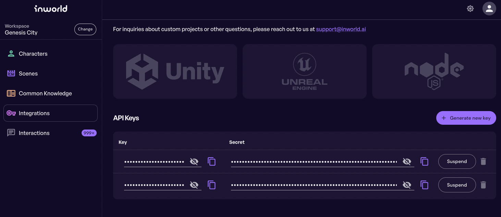
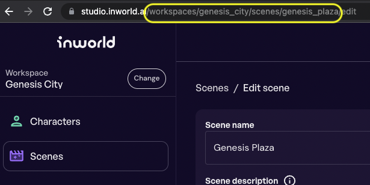

# Welcome to Inworld AI Colyseus Service! 

Inworld AI JS SDK is not compatible with DCL runtime (depends on too many things the Decentraland runtime does not have out of the box). This provides a workaround by acting as a proxy.  There are benefits to this approach such as the ability upgrade the SDK, bug fixing (to some extent) to optimize and the connection on the server instead of on the client.

This project has been created using [⚔️ `create-colyseus-app`](https://github.com/colyseus/create-colyseus-app/) - an npm init template for kick starting a Colyseus project in TypeScript.

[Documentation](http://docs.colyseus.io/)


## :crossed_swords: Usage

In the proxy server code folder, from terminal run

```
npm install 
```
> only required the first time


Start server

```
npm run start
```
You will see the following meaning it started successfully.  You may visit [localhost:2567](localhost:2567) this URL in a browser to also verify


```
🏟  Your Colyseus App
⚔️  Listening on ws://localhost:2567
```

## Configuration

### Proxy Server

`development.env` - configuration for local server

`arena.env` - configuration for deployed server

In both of these you will find configuration that needs to be updated.   

NOTE: Server must be restarted to pick up changes.

```
# configuration for NpcChatRoom.ts should you connnect directly to it
NPC_ROOM_INWORLD_KEY= SECRET
NPC_ROOM_INWORLD_SECRET= SECRET
NPC_ROOM_INWORLD_SCENE=workspaces/{WORKSPACE_NAME}/scenes/{SCENE_NAME}

# configuration for GenesisPlazaRoom should you connnect to this room
GENESIS_CITY_NPC_ROOM_INWORLD_KEY= SECRET
GENESIS_CITY_NPC_ROOM_INWORLD_SECRET= SECRET
GENESIS_CITY_NPC_ROOM_INWORLD_SCENE=workspaces/{WORKSPACE_NAME}/scenes/{SCENE_NAME}
```

`INWORLD_KEY` and `INWORLD_SECRET`
Go to the InWorld AI studio.  Under the Integrations section you will create a key and secret



`INWORLD_SCENE` will be taken from the URL of your created scene




## Structure

- `index.ts`: main entry point, register an empty room handler and attach [`@colyseus/monitor`](https://github.com/colyseus/colyseus-monitor)
- `src/rooms/MyRoom.ts`: an empty room handler for you to implement your logic
- `src/rooms/schema/NpcChatRoom.ts`: is the room you that handles proxying requests to and from Inworld AI. 
- `src/rooms/schema/GenesisPlazaRoom.ts`: is the room you will connect to using a command pattern passing calls to NpcChatRoom.  This allows you to put other game logic in here and keep it encapsulated
- `loadtest/example.ts`: scriptable client for the loadtest tool (see `npm run loadtest`)
- `package.json`:
    - `scripts`:
        - `npm start`: runs `ts-node-dev index.ts`
        - `npm run loadtest`: runs the [`@colyseus/loadtest`](https://github.com/colyseus/colyseus-loadtest/) tool for testing the connection, using the `loadtest/example.ts` script.
- `tsconfig.json`: TypeScript configuration file


## License

MIT
